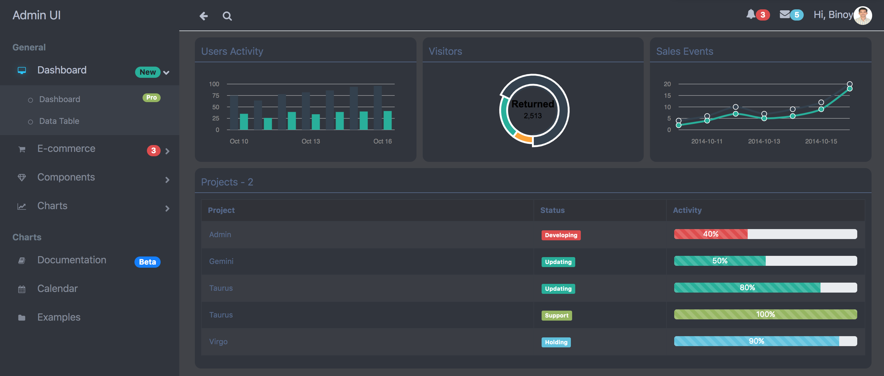
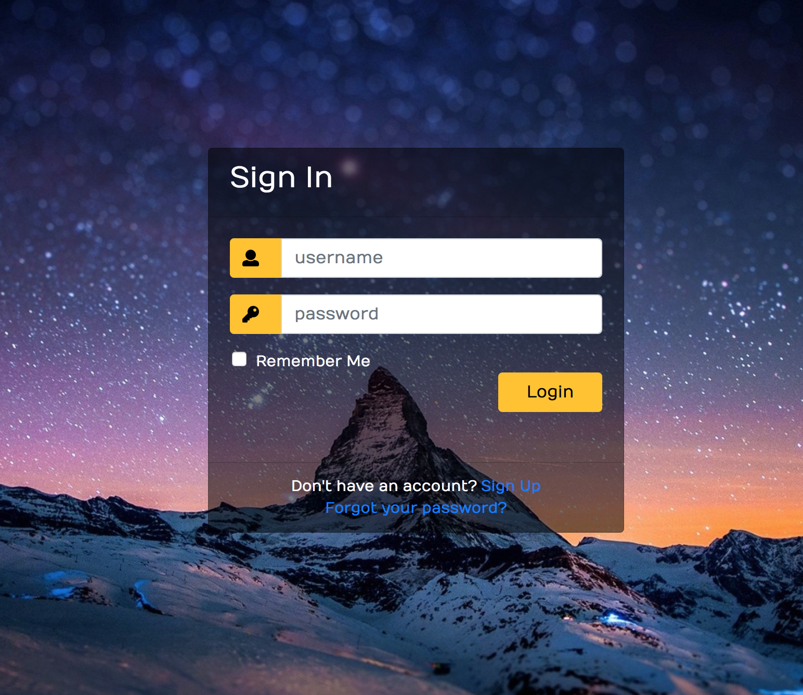
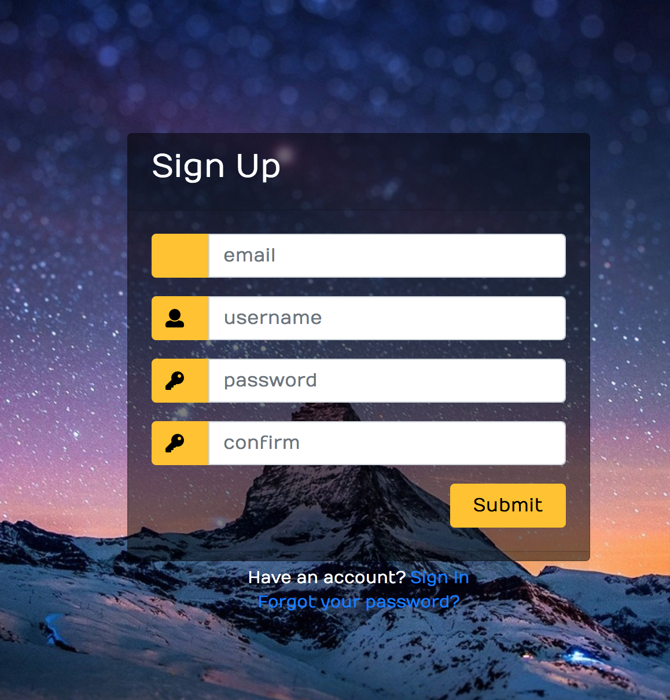

## Introduction
I am introducing the example codes for creating the Admin React Application. It provides Home Page, Sign in, Sign up,Dashboard, etc.

## Run Command

* npm start

## Screens
The below screans are available now
* Dashboard with Sidebar Menu URL http://localhost:3000/

* Sign In URL http://localhost:3000/signin or http://localhost:3000/login

* Sign Up URL http://localhost:3000/signup

