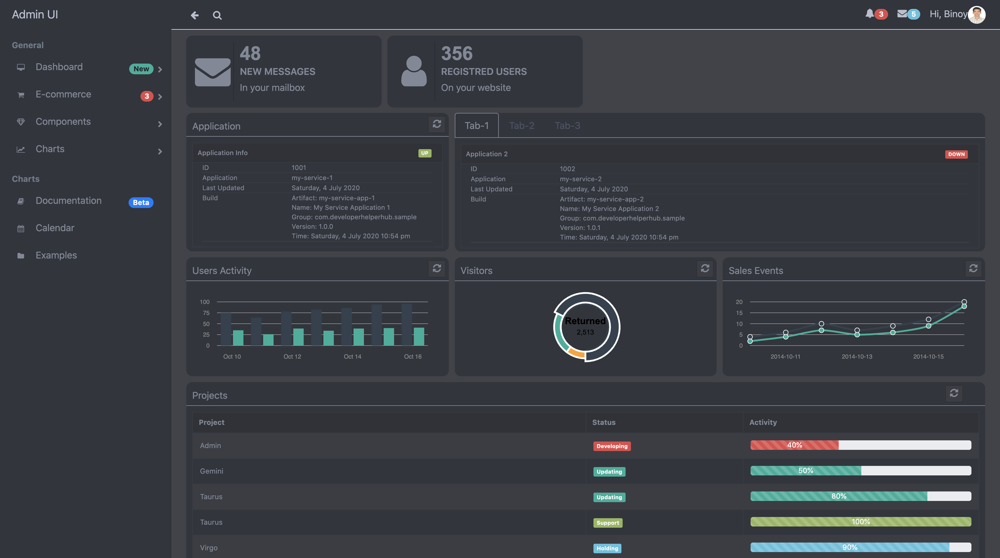

## Introduction
I am introducing the example codes for creating the Admin React Application. It provides Home Page, Sign in, Sign up,Dashboard, etc. This source started for developing the react library for create the Admin UI. I am creating reusable components, it can be avoided the mixe of html codes and react code in our application. 

## Run Command

* npm start

## Screens
The below screans are available now
* Dashboard with Sidebar Menu URL http://localhost:3000/

* Sign In URL http://localhost:3000/signin or http://localhost:3000/login

* Sign Up URL http://localhost:3000/signup

## References
* [React Rounter](https://codeburst.io/getting-started-with-react-router-5c978f70df91)
* [Login](https://bootsnipp.com/snippets/vl4R7)
* [Dashboard](https://bootsnipp.com/snippets/Q0dAX)
* [Font Awesome](https://stackoverflow.com/questions/21406538/how-to-use-font-awesome-icons-from-node-modules)